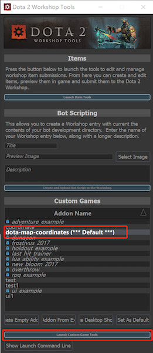

# dota-map-coordinates

Custom game for dumping map entity coordinate data to JSON and scripts for generating elevation and vision related images. See [dota vision simulation](https://github.com/devilesk/dota-vision-simulation) and [dota interactive map](https://github.com/devilesk/dota-interactive-map) for an application of the data.

## Usage

### Step 1 Copy latest Map meta data

Run `copymap.bat` to get the latest dota map files. Also creates an empty mapdata.txt output file.

### Step 2 Create the Custom game

Copy both folders `dota-map-coordinates/content/` and  `dota-map-coordinates/game/` to `<your_dota2_directory>/steamapps/common/dota 2 beta/` 

Launch the custom game in Workshop Tools (Right click the Dota 2 Icon and Choose `Launch Dota2 - Tools` You need to install it first). You could see a new Custom Games named `dota-map-coordinates`. Selete it and launch the game.

Open your Console and enter `dota_lauch_custom_game dota2`. And wait the game start. Select a hero and enter the game. Once the game lord completely the following files will be generated automatically :

* `mapdata.json` - Coordinates of all buildings, trees, shops, etc.

* `worlddata.json` - Map dimensions.

* `gridnavdata.json` - Coordinates of all untraversable 64x64 grid tiles. 

* `elevationdata.json` - Elevations of each 64x64 grid tile.

Output path:

`C:\Program Files (x86)\Steam\steamapps\common\dota 2 beta\game\dota\mapdata.txt`

> Note: The empty text files need to exist or else folders instead of text files will be created by the custom game and no output will be saved.

The text files also needs to be cleared before each run because the custom game can only append the data to the file.

### Step 3 Process the data

Run `copydata.bat` to copy the generated files from the dota directory to the data folder in the repository directory.

Run `textvmap.bat` to generate the vmap.txt files using dmxconvert. Text vmaps can also be created by opening the prefab files in Hammer and doing Save Copy As Text.

Run `process_data.py` to generate json and images based on the data. Some requirements need to be installed and it‘s supported by `python 2.7` 

## Output

The following images are created:

* `gridnav.png` - Generated from gridnavdata.json.

* `elevation.png` - Generated from elevationdata.json.

* `tree_elevation.png` - Generated from mapdata.json.

* `ent_fow_blocker_node.png` - Generated from text versions of map prefab files, dota_pvp_prefab.vmap and dota_custom_default_000.vmap.

* `map_data.png` - All the above images stitched together horizontally into one image.